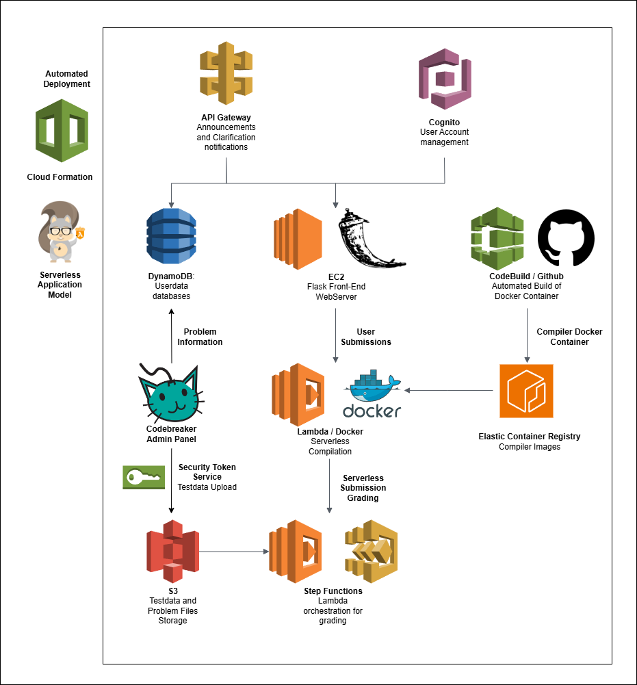

# Codebreaker Contest Manager

## Introduction

Codebreaker is the national online judge of Singapore. It is home to 1,400 problems and over 3,000 users, and has performed **national team selection** for the International Olympiad of Informatics teams in Singapore and Indonesia.

The primary motivation for Singapore’s migration to Codebreaker is **lowering operating costs**. Despite having run for over 4 years and having graded hundreds of thousands of submissions, the total operational cost of Codebreaker is under $2000.

Codebreaker Contest System is a fork of the Codebreaker architecture that serves to allow for **easy and independent** usage of Codebreaker to run contests. In that way, Codebreaker Contest serves to be a more **cost-efficient** and more user-friendly version of the gold standard of contest organization and management, CMS.

## Codebreker Statistics

As of time of writing (June 2024), here are the statistics for [Codebreaker](https://codebreaker.xyz) (main site).

- Average traffic (Page requests) on CloudFlare per month is between 1,200,000 to 1,500,000
- Codebreaker has graded a total of 510,000 submissions.
- Codebreaker has 4,650 registerd users, coming from a 71 different countries
- Codebreaker has a total of 1,600 different problems, coming from a mixture of public sources and the Singapore training system.

## Codebreaker Infrastructure Overview

Codebreaker runs on Amazon Web Services’ **Serverless Architecture** for compilation and grading of submissions. By abstracting away all of the heavy computation from the front-end web server, the web server thus only needs the resources necessary to support simple database API call operations and Flask hosting. This also avoids the need to **over-provision** resources, like having a large static server with a large number of workers running to perform grading.

To support problems with hundreds of testcases, we use Express Step Functions to orchestrate our Lambda workflow. This supports the **concurrent invocations** of hundreds of independent Lambda graders that will grade each of the testcases. This allows for extremely quick grading times for an optimal user interface. As per latest benchmark, the problem `housevisit` with 562 testcases is graded in about 11-12 seconds.

Codebreaker Contest is built on CI/CD tools and Infrastructure As Code (IaaC). This allows for **automated deployment** of the entire ecosystem -- Databases, Storage, Compute and Grading instances -- all from the click of (a few) buttons. The entire architecture will be **completely within your own AWS account**, giving users complete ownership of the technical stack. This facilitates better security and permission allocation of testdata and problems, as well as simplified billing.

## Architecture

1. All AWS resources are provisioned through **Amazon CloudFormation** and **Serverless Application Model (SAM)**. Users are only required to set parameters like judge name and timezone and all the resources will automatically be set up.
2. The front-end web server is a Flask server running on an **AWS Elastic Compute Cloud (EC2)** instance. The server is deployed with **Gunicorn** and reverse proxied with **Nginx**. All these are automatically set up with **EC2 Bootstrap Scripts**.
3. Codebreaker’s grading is performed serverlessly through an **AWS Step Functions** and **AWS Lambda** workflow. The steps are as follows:
   1. The submission is initialized and an entry created in DynamoDB.
   2. The submission is compiled with a custom **Ubuntu OS Docker container** that has GCC and Lambda installed.
      a. Lambda relies on the container being built in the user’s **Elastic Container Repository (ECR)** instance. As such, CodeBuild will get the set-up scripts from Github and compile the container, before uploading it to ECR.
      b. The same tech stack is also used for compilation of checkers. As such, Codebreaker supports `testlib.h`, the industry-standard Competitve Programming checker and grader library.
   3. Step Functions will concurrently invoke **wrapper Lambda functions** for testcase grading. This supports separation of permissions, allowing Lambda to function as a Sandbox for code execution before the wrapper will update the database. Note that the wrapper can have extremely **low memory allocation**, allowing for negligible compute costs.
   4. When all invocations have completed, a lambda function aggregates the testcase results and provides a final score.
4. The main Codebreaker data storage uses **AWS DynamoDB** as a serverless database that stores user and problem data.
   1. Website functionality is provided through DynamoDB **Global Secondary Indexes** for fast and robust queries.
5. **AWS Simple Storage Service (S3)** is used for file storage for testdata and submissions.
   1. **S3 Lifecycle rules** are used to transfer testcases from older problems to infrequent access storage tier to save costs.
   2. Testdata is uploaded through the admin panel. For each problem, an **ephemeral IAM role** is created with appropriate permissions that allows `PutItem` access to a specific folder of the **testdata bucket**. **Security Token Service (STS)** is used to generate temporary AWS credentials that are passed to the front-end and uses the front-end SDK to upload the files. This allows for direct uploads to S3 with built-in **multipart uploads**.
6. Contest announcements and notifications of incoming clarifications (for admins) is done through the use of **AWS API Gateway**. Front-end clients make SDK calls to an API Gateway **WebSocket endpoint**, which will be used to invoke the relevant notifications through AWS Lambda. This abstracts away web socket connections from the front-end server.
7. User accounts and authentication are handled through **Amazon Cognito**. In the context of contests, all user accounts should be created by admins. Random credentials are generated, available for 1-time download and stored securely in an **Amazon Cognito User Pool**.

## Repository Contents

- The `auto` directory stores the Serverless Application Model libraries to deploy the infrastructure.
- The `admin` and `main` directories store the Flask back-end server files. `static` and `templates` hold static web assets and JinJa templates.
- The `awstools` library stores any functionality for interacting with AWS, organized by functionality and/or service.
- The `init` directory stores the basic setup files and sample problems, providing 1 sample problem of each type: Batch, Interactive and Communication.

## Limitations

Of course, it is natural that some trade-offs have to be made as compared to a system as secure and reliable as CMS. In particular, the grading fluctuations in Codebreaker have a slightly greater variance, and some of the specific memory leakages in interactive problems may not be protected against. However, at the end of the day, our goal isn’t to be a completely secure gold standard, it’s to provide **free and simple to use** contest management.

If there is demand, it is possible to release a guide on a fully automatically deployed version of Codebreaker (analysis mode judge).
